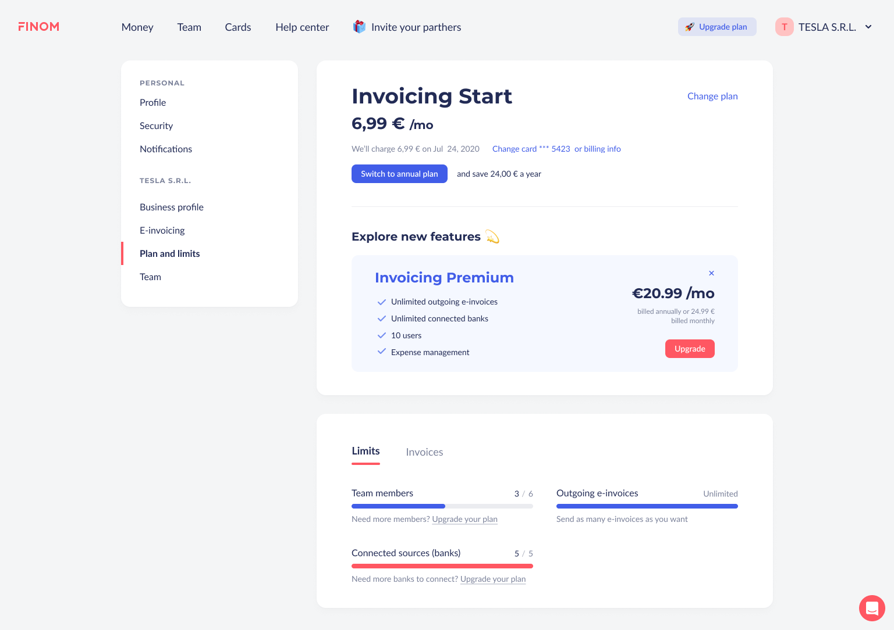

# Test Assignment for Finom: Layout Implementation

This project is the implementation of a test assignment for layout design. The result is available for web viewing, and the source code is provided for review.

## 📍Implementation Features

- **Cross-browser Compatibility**: Support has been implemented for the latest 5 versions of Google Chrome, Mozilla Firefox on Windows and MacOS, and Safari on MacOS starting from version 14.
- **Responsiveness**: The layout is responsive starting from a width of 900px.
- **Interactivity**: React is used to implement the tab switching functionality in the settings and the dropdown menu for company selection.
- **Animations**: Animations and interactive states have been added for control elements.
- **Semantic Markup and Accessibility**: Semantic markup has been applied with a focus on element accessibility, without overdoing it.

## 📍Technologies
- React
- HTML5
- CSS3
- JavaScript (ES6+)
- Webpack
- ESLint + Prettier for code linting and formatting

## 📍Project Setup

To run the project on your local machine, follow these steps:
1. Clone the repository:
```bash
git clone <repository link>
```
2. Install the dependencies:
```bash
npm install
```
3. Run the project:
```bash
npm start
```
4. Open the project in your browser at `http://localhost:8080/`

5. To build the project for production, run:
```bash
npm run build
```

## 📍Demo
The project is deployed and available at the following link:
https://nrenata.github.io/Finom-personal-account/



## 📍Source
The project's source code is available in this repository.

____________________

## 📍Known Issues
During development, the following problems were identified, which are planned to be fixed in future updates:

1. Lack of adaptation for mobile devices
2. Duplicate styles
3. Routing to follow menu links
4. Fonts 

## 📍Future plans
1. Responsive Design
2. Obtaining results from interaction with components: for example, when you click on other tabs, display loading